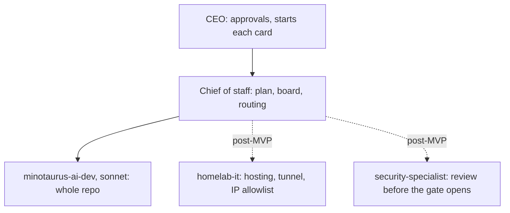

# Team

```mermaid
flowchart TD
  CEO[CEO: approvals, starts each card] --> CoS[Chief of staff: plan, board, routing]
  CoS --> Dev[minotaurus-ai-dev, sonnet: whole repo]
  CoS -. post-MVP .-> IT[homelab-it: hosting, tunnel, IP allowlist]
  CoS -. post-MVP .-> Sec[security-specialist: review before the gate opens]
```

## Involvement log

| Date | Who | What |
|---|---|---|
| 2026-11-21 | chief of staff | design with EGM (Overview, Technical Plan, Alternatives, Implementation); skeleton; board |
